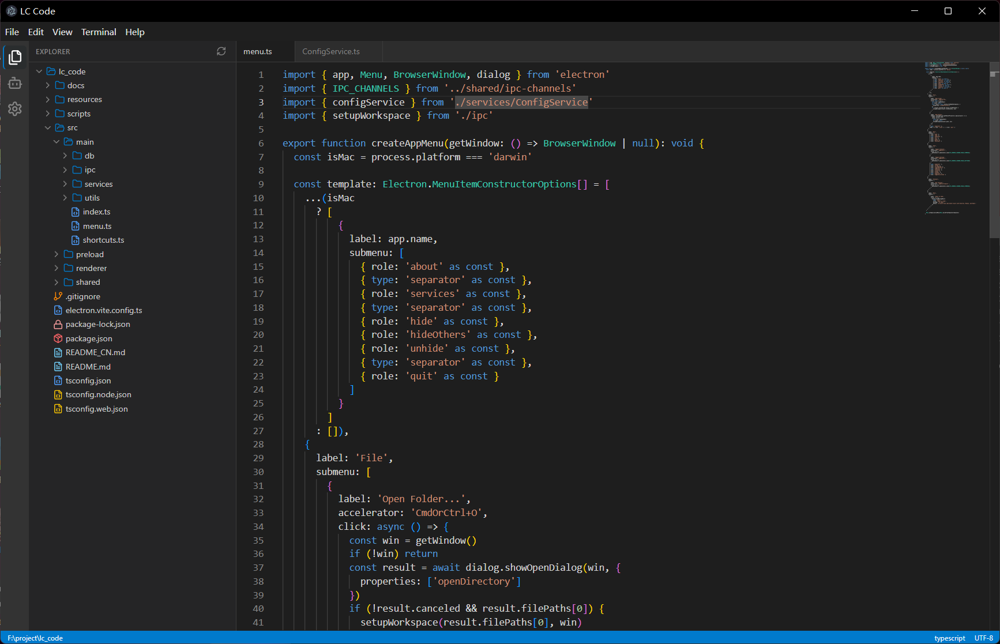
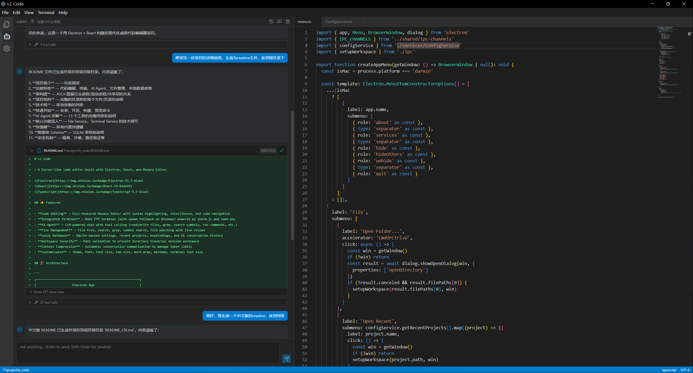

# LC Code

> 💻 AI-powered desktop code editor built with Electron + React. Features: Monaco Editor, integrated terminal, multi-session AI agent, SQLite storage, and more.


## 📸 Screenshots

### Code Editor

Monaco Editor with file tree, syntax highlighting, and TypeScript IntelliSense.



### AI Agent Panel

Multi-session AI chat with tool calling, streaming responses, and side-by-side code editing.



## ✨ Features

- **Code Editing** — Full-featured Monaco Editor with syntax highlighting, IntelliSense, TypeScript lib support, and code navigation
- **Integrated Terminal** — Real PTY terminal (with spawn fallback on Windows) powered by xterm.js and node-pty
- **AI Agent** — LLM-powered chat with multi-session support, tool calling (13 tools), context compression, and streaming
- **File Management** — File tree, search, grep, symbol search, TypeScript lib loading, file watching with live reload
- **Local Database** — SQLite-backed settings, recent projects, keybindings, multi-conversation history, and workspace state
- **Workspace Security** — Path validation to prevent directory traversal outside workspace
- **Context Compression** — Automatic conversation summarization with recursive compression when token limits approach
- **Customizable** — Theme, font, font size, tab size, word wrap, minimap, terminal font size

## 🏗️ Architecture

```
┌─────────────────────────────────────────────────────────────────┐
│                    Electron App                                 │
├──────────────────┬──────────────────────────────────────────────┤
│   Main Process   │      Renderer Process (React)                │
│                  │                                              │
│  ┌────────────┐  │  ┌──────────────────────────────────────┐   │
│  │  IPC       │◄─┼──│  UI Components                       │   │
│  │  Handlers  │  │  │  (ActivityBar, Sidebar,              │   │
│  └────┬───────┘  │  │   EditorArea, BottomPanel,           │   │
│       │          │  │   AgentPanel, SettingsPanel)         │   │
│  ┌────▼───────┐  │  └──────────────────────────────────────┘   │
│  │  Services  │  │  ┌──────────────────────────────────────┐   │
│  │  (Modular) │  │  │  Zustand Stores                      │   │
│  │            │  │  │  (Workspace, Editor, Agent, UI)      │   │
│  │  File      │  │  └──────────────────────────────────────┘   │
│  │  Terminal  │  │                                              │
│  │  Config    │  │  ┌──────────────────────────────────────┐   │
│  │  Editor    │  │  │  Monaco Editor                       │   │
│  │  Agent     │  │  │  (with TypeScript lib support)       │   │
│  │  Context   │  │  └──────────────────────────────────────┘   │
│  │  Command   │  │  ┌──────────────────────────────────────┐   │
│  │  Security  │  │  │  xterm Terminal                      │   │
│  │            │  │  └──────────────────────────────────────┘   │
│  └────┬───────┘  └────────────────────────────────────────────┘
│       │
│  ┌────▼───────┐
│  │  SQLite    │
│  │  Database  │
│  └────────────┘
├─────────────────────────────────────────────────────────────────┤
│              Shared Types & Constants                           │
│              (ipc-channels.ts, types.ts, agent-types.ts)        │
└─────────────────────────────────────────────────────────────────┘
```

### Service Layer Architecture

```
┌──────────────────────────────────────────────────────────────┐
│                      Agent Service Layer                     │
├──────────────────────────────────────────────────────────────┤
│  AgentService      → LLM chat, tool calling loop             │
│  AgentChatService  → Multi-session CRUD, conversation        │
│  AgentToolService  → 13 tool definitions & execution         │
│  ContextService    → Context compression & summarization     │
│  ContextApi        → Context snapshot & token tracking       │
│  CommandService    → Shell command execution                 │
└──────────────────────────────────────────────────────────────┘
```

## 📁 Project Structure

```
lc-code/
├── src/
│   ├── main/                  # Electron main process
│   │   ├── index.ts           # App entry point
│   │   ├── menu.ts            # Native menu (File, Edit, View, etc.)
│   │   ├── shortcuts.ts       # Global keyboard shortcuts
│   │   ├── ipc/               # IPC channel definitions & handlers
│   │   │   ├── index.ts
│   │   │   ├── file.ipc.ts
│   │   │   ├── terminal.ipc.ts
│   │   │   ├── config.ipc.ts
│   │   │   ├── dialog.ipc.ts
│   │   │   ├── editor.ipc.ts
│   │   │   └── agent.ipc.ts
│   │   ├── services/          # Core services (modular)
│   │   │   ├── FileService.ts         # File operations, watching, TS libs
│   │   │   ├── TerminalService.ts     # PTY terminal management
│   │   │   ├── ConfigService.ts       # Settings & preferences
│   │   │   ├── EditorService.ts       # Open file management
│   │   │   ├── SecurityService.ts     # Workspace path validation
│   │   │   ├── AgentService.ts        # LLM chat & tool calling loop
│   │   │   ├── AgentChatService.ts    # Multi-session conversations
│   │   │   ├── AgentToolService.ts    # 13 tool definitions & execution
│   │   │   ├── ContextService.ts      # Context compression
│   │   │   ├── CommandService.ts      # Shell command execution
│   │   │   └── file-utils.ts          # File utility functions
│   │   ├── db/
│   │   │   ├── database.ts      # SQLite connection & WAL mode
│   │   │   └── migrations.ts    # Schema migrations & seeding
│   │   └── utils/
│   │       └── logger.ts        # Logging utility
│   ├── preload/
│   │   └── index.ts             # contextBridge API exposure
│   ├── renderer/                # React rendering process
│   │   ├── main.tsx             # React entry point
│   │   ├── App.tsx              # Root component
│   │   ├── index.css            # Global styles (Tailwind)
│   │   ├── env.d.ts             # TypeScript declarations
│   │   ├── components/
│   │   │   ├── layout/          # App layout components
│   │   │   │   ├── ActivityBar.tsx
│   │   │   │   ├── Sidebar.tsx
│   │   │   │   ├── EditorArea.tsx
│   │   │   │   ├── BottomPanel.tsx
│   │   │   │   ├── StatusBar.tsx
│   │   │   │   └── WelcomePage.tsx
│   │   │   ├── editor/          # Monaco editor wrappers
│   │   │   │   ├── MonacoEditor.tsx
│   │   │   │   ├── EditorPane.tsx
│   │   │   │   ├── TabBar.tsx
│   │   │   │   ├── MarkdownPreview.tsx
│   │   │   │   └── MarkdownViewToolbar.tsx
│   │   │   ├── file-tree/       # File tree component
│   │   │   │   ├── FileTree.tsx
│   │   │   │   └── FileTypeIcon.tsx
│   │   │   ├── terminal/        # Terminal component
│   │   │   │   └── TerminalPanel.tsx
│   │   │   ├── agent/           # AI agent chat UI
│   │   │   │   ├── AgentPanel.tsx
│   │   │   │   ├── ConversationHistory.tsx
│   │   │   │   ├── CodeChangeBlock.tsx
│   │   │   │   └── ContextRing.tsx
│   │   │   ├── settings/        # Settings panel
│   │   │   │   └── SettingsPanel.tsx
│   │   │   ├── ui/              # Shared UI primitives (Radix UI)
│   │   │   │   ├── button.tsx
│   │   │   │   ├── input.tsx
│   │   │   │   ├── scroll-area.tsx
│   │   │   │   ├── separator.tsx
│   │   │   │   └── switch.tsx
│   │   │   └── ErrorBoundary.tsx
│   │   ├── lib/
│   │   │   ├── monaco-setup.ts  # Monaco configuration
│   │   │   ├── monaco-uri.ts    # Monaco URI handling
│   │   │   ├── monaco-workspace.ts  # Monaco workspace config
│   │   │   ├── file-icons.ts    # File icon mapping
│   │   │   └── utils.ts
│   │   └── stores/              # Zustand state stores
│   │       ├── index.ts
│   │       ├── agentStore.ts
│   │       └── ...
│   └── shared/                  # Main & Renderer shared code
│       ├── types.ts             # Core TypeScript types
│       ├── ipc-channels.ts      # IPC channel constants
│       ├── file-types.ts        # File operation types
│       ├── agent-types.ts       # AI agent types & config
│       ├── agent-context.ts     # Context compression logic
│       ├── agent-tool-display.ts  # Code change extraction & diff
│       └── type-lib-types.ts    # TypeScript library types
├── resources/                   # Static assets
├── scripts/
│   ├── install-native.js        # Native dependency installer
│   ├── build-demo-gif.py        # Demo GIF builder
│   └── capture-window.ps1       # Window screenshot script
├── docs/
│   └── demo/
│       ├── screenshots/
│       └── ...
├── electron.vite.config.ts      # Electron-Vite configuration
├── package.json
├── tsconfig.json
├── tsconfig.node.json           # Main process TS config
└── tsconfig.web.json            # Renderer process TS config
```

## 🛠️ Tech Stack

| Category | Technology |
|----------|-----------|
| **Framework** | Electron 33 + Electron-Vite |
| **Frontend** | React 19 + TypeScript |
| **Editor** | Monaco Editor (`@monaco-editor/react`) |
| **Terminal** | xterm.js + node-pty |
| **State Management** | Zustand |
| **Database** | better-sqlite3 (WAL mode) |
| **File Watching** | chokidar |
| **Styling** | Tailwind CSS 4 |
| **UI Components** | Radix UI (Dialog, Tabs, Tooltip, ScrollArea, etc.) |
| **Icons** | lucide-react |
| **Markdown** | react-markdown + remark-gfm + rehype-raw |
| **Build** | Vite + electron-builder |

## 📦 Getting Started

### Prerequisites

- Node.js 18+
- npm or yarn

### Installation

```bash
# Clone the repository
git clone https://github.com/<your-username>/lc-code.git
cd lc-code

# Install dependencies
npm install

# Postinstall will handle native dependencies (better-sqlite3, node-pty)
```

### Development

```bash
# Start development server with hot reload
npm run dev
```

### Build

```bash
# Build for production
npm run build

# Package the application
npm run dist

# Package for Windows only
npm run dist:win
```

### Preview

```bash
# Preview the built application
npm run preview
```

### Native Dependencies

If native modules fail to build:

```bash
# Rebuild native dependencies
npm run rebuild
```

## 🔑 Key Features Deep Dive

### AI Agent (Multi-Session)

The built-in AI agent supports:

- **Multi-Session** — Multiple conversations per workspace, persisted in SQLite
- **Tool Calling** — 13 built-in tools for file operations, code search, shell commands
- **Context Compression** — Automatic conversation summarization with recursive compression
- **Streaming** — Simulated streaming responses via IPC events
- **Context Snapshots** — Token usage tracking and limit management
- **Code Change Tracking** — Extract and display file modifications from tool calls
- **Customizable** — Configurable API endpoint, model, API key, temperature, max tokens, context window

**Available Agent Tools:**

| Tool | Description |
|------|-------------|
| `read_file` | Read file contents with optional line range |
| `write_file` | Write or overwrite files |
| `apply_edit` | Precise text replacement (prefer over write_file) |
| `list_directory` | List files and directories recursively |
| `search_files` | Glob pattern file search |
| `grep` | Text search with regex support |
| `search_symbols` | Find functions, classes, interfaces |
| `get_file_info` | File metadata (size, mtime, etc.) |
| `create_directory` | Create directories with parents |
| `delete_file` | Delete files or directories |
| `move_file` | Rename or move files |
| `get_open_files` | Get currently open editor files |
| `run_command` | Execute shell commands |

### File Service

- **Path Resolution** — Resolves relative paths against workspace root
- **Security** — Validates all paths stay within workspace bounds
- **File Watching** — Real-time file change notifications via chokidar
- **Symbol Search** — Regex-based code symbol extraction for TS/JS files
- **Grep** — Multi-file text search with regex, glob filtering, case sensitivity
- **TypeScript Lib Loading** — Loads `.d.ts` files for IntelliSense (priority: electron > node > react > react-dom > @types > package.json types)

### Terminal Service

- **PTY Backend** — Uses `node-pty` for full terminal emulation
- **Spawn Fallback** — Falls back to `spawn()` on Windows without VS Build Tools
- **Auto Shell Detection** — Detects default shell from environment variables
- **Workspace CWD** — Terminals start in workspace root by default
- **Multi-Terminal** — Multiple terminal sessions managed by UUID

### Context Compression

The context compression system works as follows:

1. **Token Estimation** — Estimates token usage for messages and system prompt
2. **Compression Trigger** — Activates when usage reaches 85% of context budget
3. **Keep Recent** — Preserves the last 6 messages as fresh context
4. **Summarize Older** — Sends older messages to LLM for summarization
5. **Recursive Compression** — If still over budget, recursively compresses merged summary
6. **Fallback** — Falls back to truncation if summarization fails

## ⌨️ Keyboard Shortcuts

| Shortcut | Action |
|----------|--------|
| `Ctrl+O` | Open folder |
| `Ctrl+S` | Save file |
| `Ctrl+`` ` | Toggle terminal |
| `Ctrl+,` | Toggle settings |
| `Ctrl+Shift+N` | Toggle terminal (reserved) |

## 🗄️ Database Schema

The SQLite database (`lc-code.db`) stores:

| Table | Purpose |
|-------|---------|
| **settings** | Application preferences and agent configuration |
| **recent_projects** | Last 10 opened workspace paths |
| **keybindings** | Custom keyboard shortcut mappings |
| **agent_chat_sessions** | Legacy single-session storage (migrated) |
| **agent_conversations** | Multi-conversation storage with messages and context |
| **agent_workspace_state** | Active conversation tracking per workspace |

### Table Details

**agent_conversations**
- `id` (TEXT PK) — Unique conversation identifier
- `workspace_path` (TEXT) — Associated workspace
- `title` (TEXT) — Conversation title (auto-derived from first message)
- `context_summary` (TEXT) — Compressed conversation summary
- `context_used/limit/source` (INTEGER/TEXT) — Token tracking
- `messages_json` (TEXT) — Serialized message array
- `created_at/updated_at` (INTEGER) — Timestamps

**agent_workspace_state**
- `workspace_path` (TEXT PK) — Workspace identifier
- `active_conversation_id` (TEXT) — Currently active conversation

## 🔒 Security

- **Context Isolation** — `contextIsolation: true`, `nodeIntegration: false`
- **Sandbox** — Renderer runs in sandbox mode
- **Path Validation** — All file operations validated against workspace root
- **Ignored Directories** — Skips `node_modules`, `.git`, `dist`, `out`, `release`, `.cursor`, `coverage`, `.next`, `build`
- **File Size Limits** — 5MB limit for read operations
- **External Links** — Links opened in browser, not in Electron window

## 📄 License

MIT
